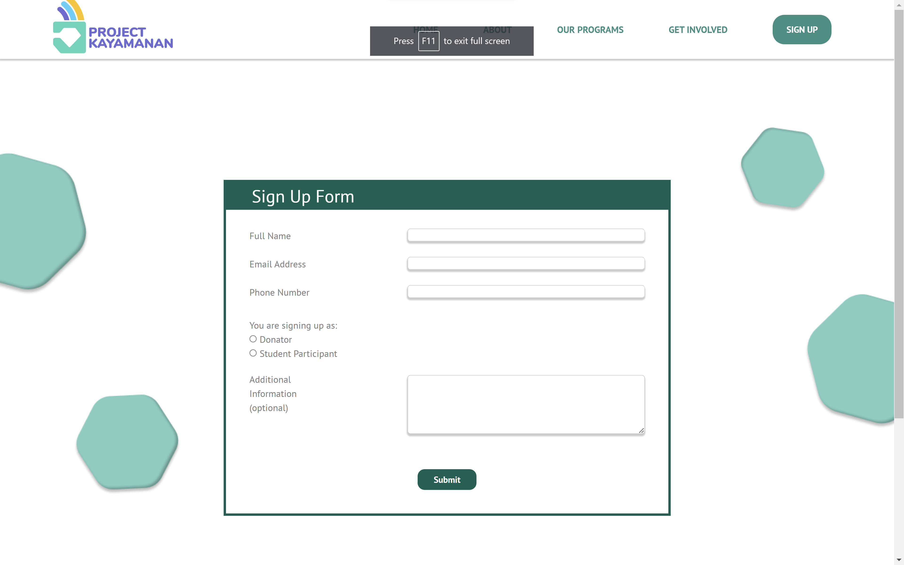
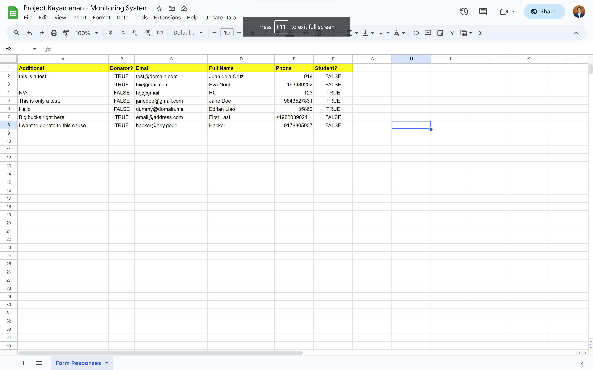

# Project Kayamananan

Project Kayamanan is a non-profit organization in the Philippines funded by the Young Southeast Asian Leaders Initiative (YSEALI) that aims to provide financial literacy coaching sessions to high school students. Last October 2022, I was part of a team of 4 (1 product manager and 3 software engineers) tasked to build a website for them to expand their reach throughout Manila and the other island groups in the Philippines.


## Table of Contents
- [Project Overview](#project-overview)
- [Technologies Used](#technologies-used)
- [Usage](#usage)
- [Acknowledgments](#acknowledgments)

## Project Overview

Based on the organization's wishes, our team was tasked with (1) improving the front-end side of the app and (2) incorporating the back-end side from scratch which I mostly did during my time with the project. They wanted to expand their network and resources by adding a forms tab that asks students or donors to provide their information when interested. Previously, they were only doing these by messaging people through email and social media. They wanted to make to track them all in a more efficient and easy-to-access system. Hence, I built a straightforward monitoring system on Google Spreadsheets utilizing the Apps Script extension fetching data from Firebase (a database system offered by Google).



*Still working on the front-end for responsiveness across all devices...*

## Technologies Used

Google Firebase, Google Spreadsheet, JavaScript, HTML/CSS

## Usage

1. Both students and donors can fill out the form under the sign-up tab on the website's navigation tab.
2. Google Firebase stores the data once the form is submitted. This is enabled by the scripts tag on `signup.html`.

```JavaScript
import { initializeApp } from "https://www.gstatic.com/firebasejs/9.14.0/firebase-app.js";
import { getAnalytics } from "https://www.gstatic.com/firebasejs/9.14.0/firebase-analytics.js";
import { getDatabase, ref, set, get, child } from "https://www.gstatic.com/firebasejs/9.14.0/firebase-database.js";
```
4. App Script extension on Google Spreadsheet enables the users to fetch data from the database whenever it is opened by the user (not real-time). This feature is enabled by 'backend_script.js`.

```JavaScript
function getFirebaseData(data) {
  var firebaseUrl = "https://kayamanan-d3a22-default-rtdb.firebaseio.com"
  var result = FirebaseApp.getDatabaseByUrl(firebaseUrl).getData(data);
  return result;
}
```


## Acknowledgements

Special shoutout to my team: @hannahgarmise for managing the team, @evamnoel for improving the front-end, @alexzhou0268 for enabling Firebase, and the previous team who wrote the backbone of the HTML and CSS files.

